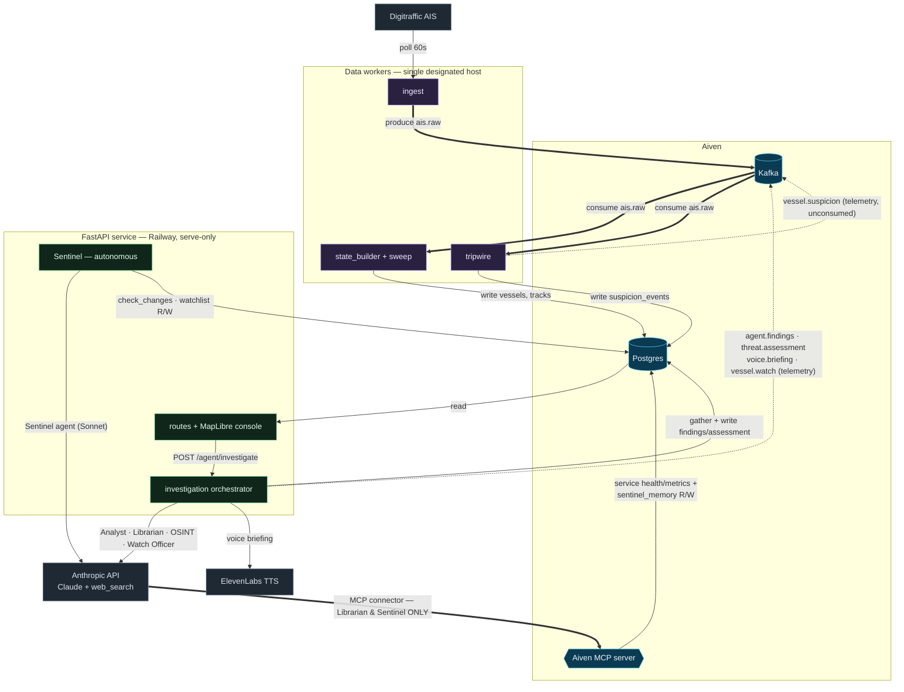
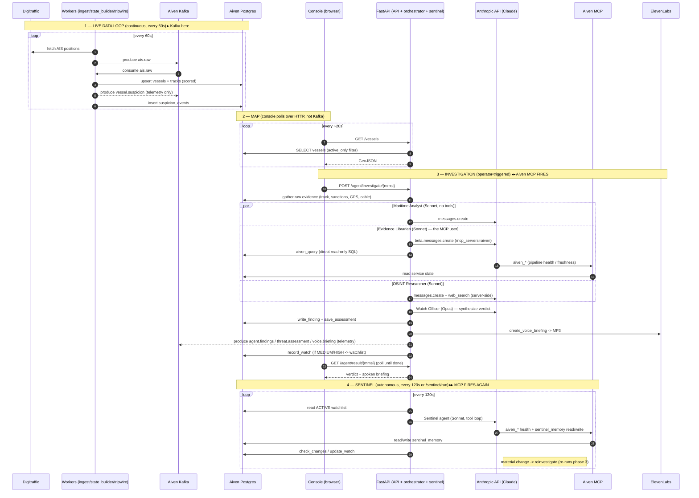

# Architecture

How Baltic Sentinel works end to end, with emphasis on **where Aiven Kafka and the Aiven
MCP are actually invoked** in the codebase. Two planes:

- **Data plane** — continuous: live AIS in → Kafka → scored vessel state in Postgres → console.
- **Investigation plane** — on demand: an operator launches a Claude agent team that
  investigates a vessel and produces a spoken verdict; an autonomous Sentinel then monitors
  the watchlist.

> GitHub renders the Mermaid diagrams below inline. To edit them, paste into
> [mermaid.live](https://mermaid.live).

---

## Where Kafka & the MCP actually fire

**Kafka is both the data spine and a telemetry bus.** Only `ais.raw` is consumed by the
app; the other five topics are *produced but never consumed* (the UI reads results over
HTTP, not Kafka — see [kafka_client.py:121](../backend/app/kafka_client.py#L121)).

| Topic | Produced by | Consumed by |
|---|---|---|
| `ais.raw` | `ingest` ([ingest.py:21](../backend/app/data_pipeline/ingest.py#L21)) | `state_builder` ([:110](../backend/app/data_pipeline/state_builder.py#L110)), `tripwire` ([:92](../backend/app/data_pipeline/tripwire.py#L92)) |
| `vessel.suspicion` | `tripwire` ([:83](../backend/app/data_pipeline/tripwire.py#L83)), `/investigate` ([routes.py:121](../backend/app/api/routes.py#L121)) | — (telemetry) |
| `agent.findings` | `write_finding` ([tools.py:272](../backend/app/agent_workflow/tools.py#L272)) | — (telemetry) |
| `threat.assessment` | `save_assessment` ([tools.py:289](../backend/app/agent_workflow/tools.py#L289)) | — (telemetry) |
| `voice.briefing` | `create_voice_briefing` ([tools.py:361](../backend/app/agent_workflow/tools.py#L361)) | — (telemetry) |
| `vessel.watch` | `record_watch` ([tools.py:401](../backend/app/agent_workflow/tools.py#L401)) | — (telemetry) |

**The Aiven MCP fires in exactly two agents**, server-side through the Anthropic beta MCP
connector ([agent_base.py:113](../backend/app/agent_workflow/agent_base.py#L113),
[:141](../backend/app/agent_workflow/agent_base.py#L141)), and only when a real token is set.
Everywhere else, Aiven Postgres is accessed directly via psycopg.

| MCP caller | When | What it does over the MCP |
|---|---|---|
| Evidence Librarian | once per investigation ([evidence_librarian.py:104](../backend/app/agent_workflow/evidence_librarian.py#L104)) | pipeline health / data freshness, to judge how much to trust the evidence |
| Sentinel | once per autonomous cycle ([sentinel.py:176](../backend/app/agent_workflow/sentinel.py#L176), [:231](../backend/app/agent_workflow/sentinel.py#L231)) | pipeline health + manages its own `sentinel_memory` table via `aiven_pg_read`/`aiven_pg_write` |

Analyst, OSINT, and Watch Officer never touch the MCP. MCP tool calls are recorded to a ring
buffer ([agent_base.py:166](../backend/app/agent_workflow/agent_base.py#L166)) and surfaced
at `GET /mcp/activity`.

---

## Diagram 1 — System architecture

---

## Diagram 2 — Lifecycle sequence (*when* Kafka and the MCP are called)

---

## Notes

- **Single-writer model.** The data workers run on one designated host; Railway runs
  serve-only. See the deployment section of the [README](../README.md).
- **Telemetry topics.** `vessel.suspicion`, `agent.findings`, `threat.assessment`,
  `voice.briefing`, and `vessel.watch` are emitted to Kafka as a streaming record of the
  system's activity (the Aiven "nervous system"), but the console reads everything it
  displays over HTTP. Closing those loops via Kafka consumers is a natural extension.
- **MCP vs direct SQL.** Most Aiven Postgres access is direct psycopg (fast, in-process).
  The MCP is used specifically where an *agent* needs to reason about the data layer itself
  (is the pipeline healthy? how fresh is the ingest?) and for the Sentinel's self-managed
  long-term memory.
